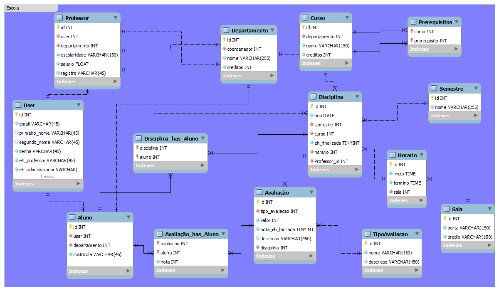
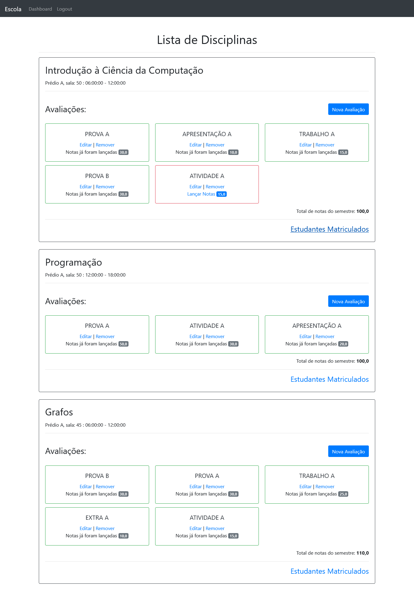
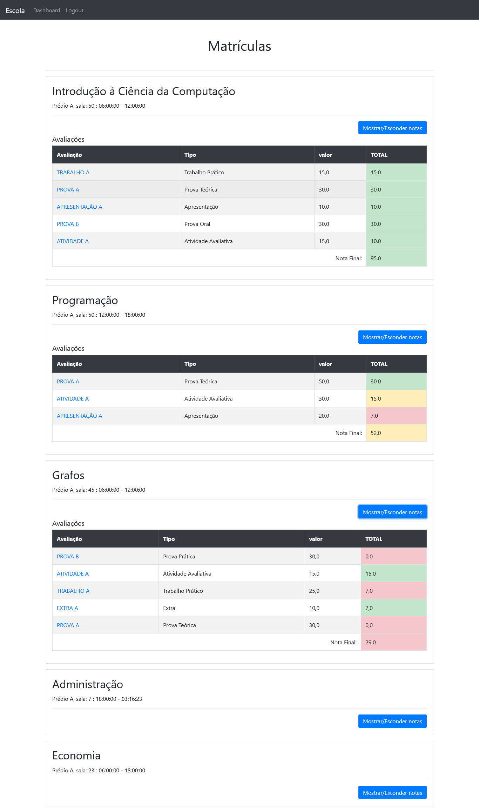
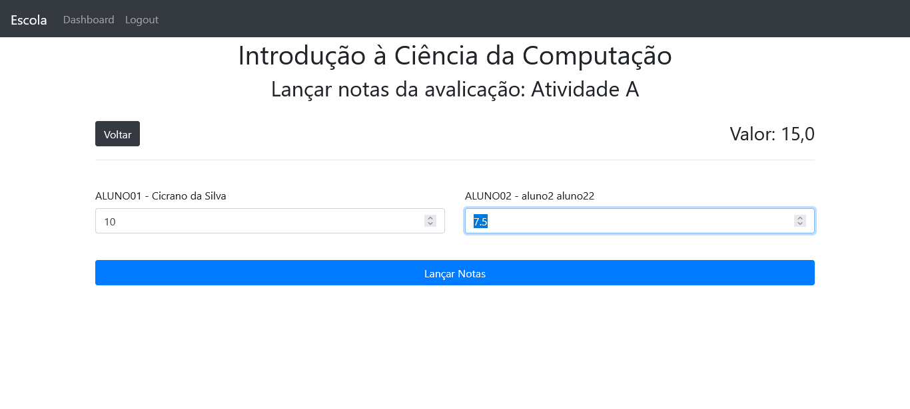
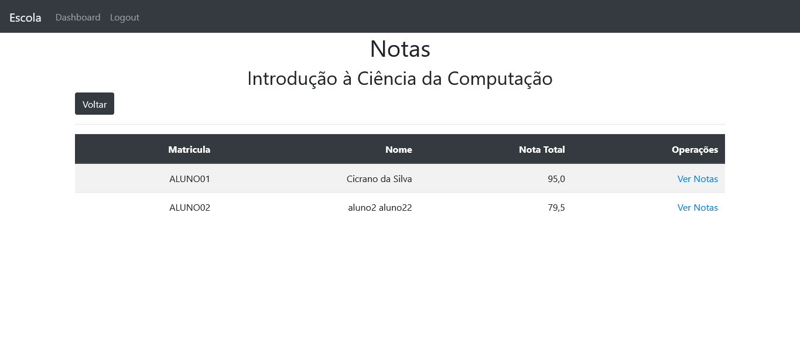
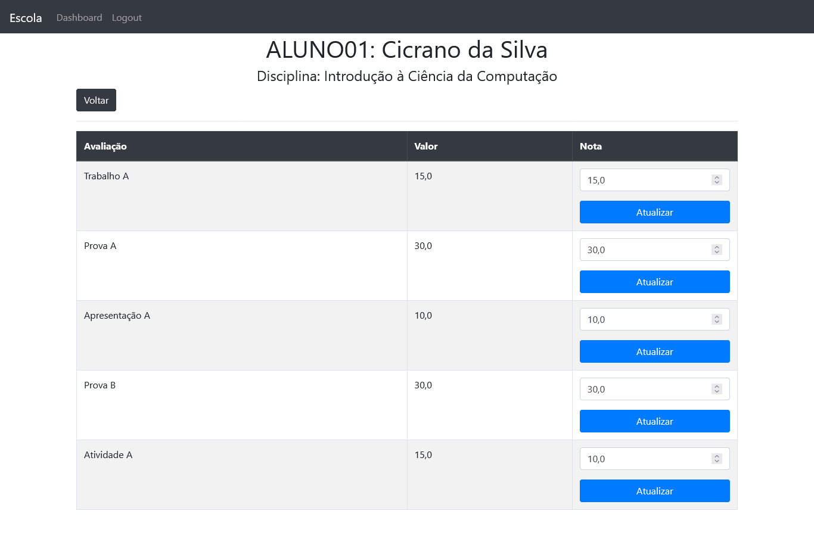
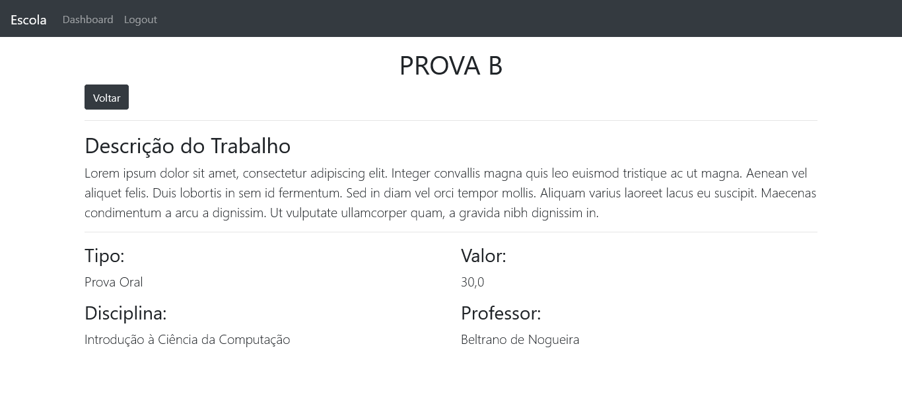
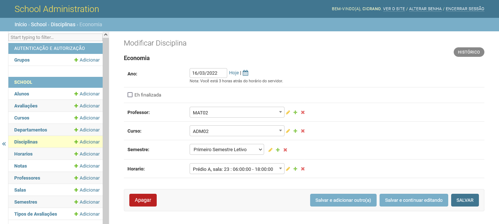

# Django - Projeto Escola

Este é um projeto de estudo do Django, afim de simular o sistema de notas de uma escola. O principal foco estava em manipular dados distribuídos em diferentes tabelas.


**Próximos Passos**:
- Provas finais e Substitutivas
- Prazo de avaliações
- Histórico do aluno

## Modelo do Banco de Dados




## 💻 Interface 

- O Dashboard de disciplinas e avaliações do professor



- O Dashboard de disciplinas e notas do aluno



- Página em que permite o professor lançar notas para todos os alunos de uma única vez com um formulário dinâmico, que aumenta de acordo com o número de alunos inscritos




- Página de relações de alunos e notas de uma dada disciplina.



- Página de notas de uma aluno, onde o professor pode atualizar cada nota individualmente


 

 - Página de detalhes de uma avaliação, disponível tanto para aluno, quanto para professor




- A página de administração da escola tem diversas funcionalidades exclusivas, como cadastrar horários, disciplinas, departamentos, etc. 




********************************************


## 🚀 Começando

Para obter uma cópia deste projeto:

```shell
git clone https://github.com/adrianomqsmts/django-escola
cd django-escola

python -m venv venv
# windows
.\venv\Scripts\activate
# linux
source  venv\bin\activate

pip install -r requirements.txt

python manage.py runserver
```

### 📋 Pré-requisitos

As bibliotecas usadas neste projeto podem ser encontradas no arquivo "requirements.txt"

```shell
pip install -r requirements.txt 
```

## 🛠️ Construído com

Ferramentas, linguagens e outras tecnologias usadas no desenvolvimento deste sistema.

* [Visual Studio Code](https://code.visualstudio.com/docs) - Ambiente de Desenvolvimento
* [Git](https://git-scm.com/) - Controle de Versões
* [Python](https://docs.python.org/3/) - Backend
* [Django](https://docs.djangoproject.com/en/4.0/) - Framework backend
* ...
... 

## ✒️ Autores

* **Desenvolvedor** - *Código e Documentação* - [Adriano](https://github.com/adrianomqsmts)

## 📄 Licença

...

